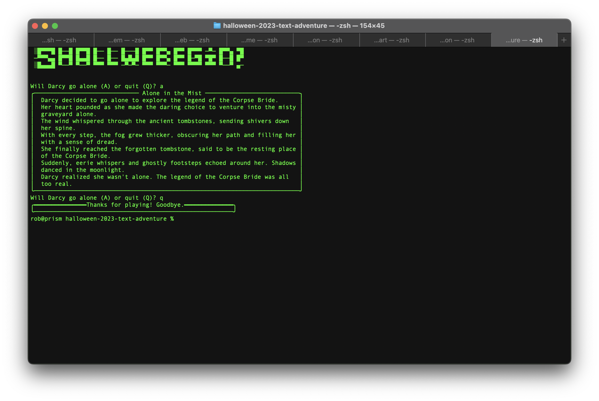
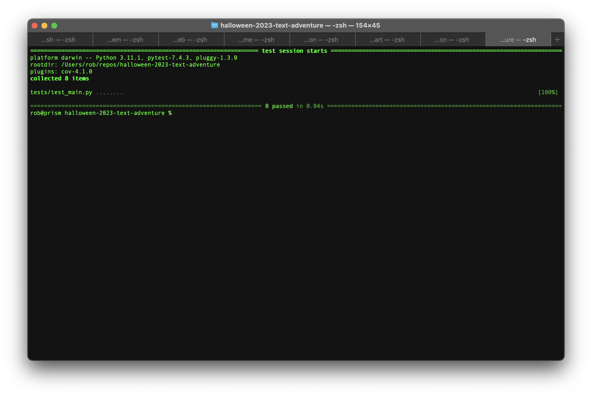
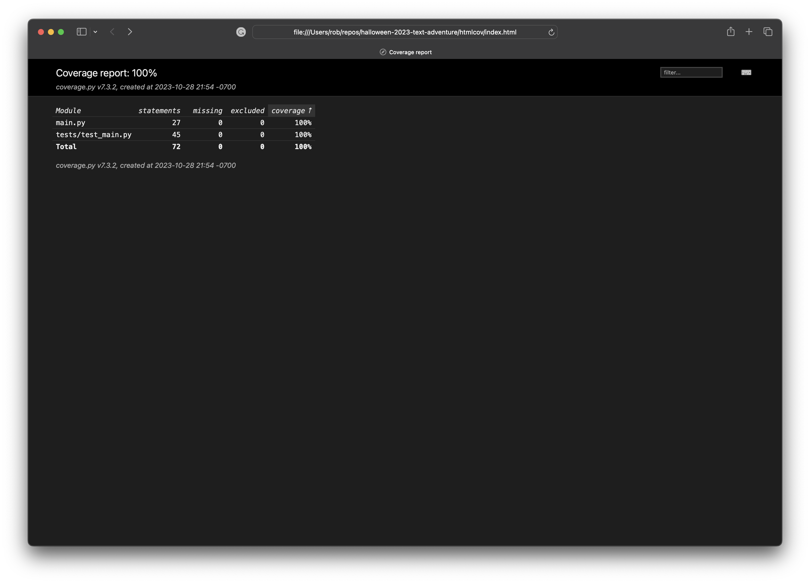
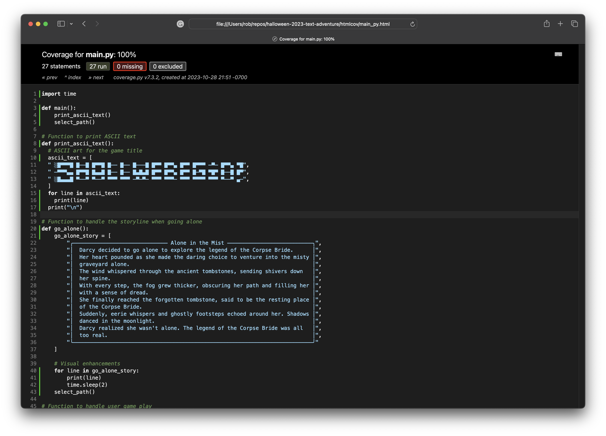
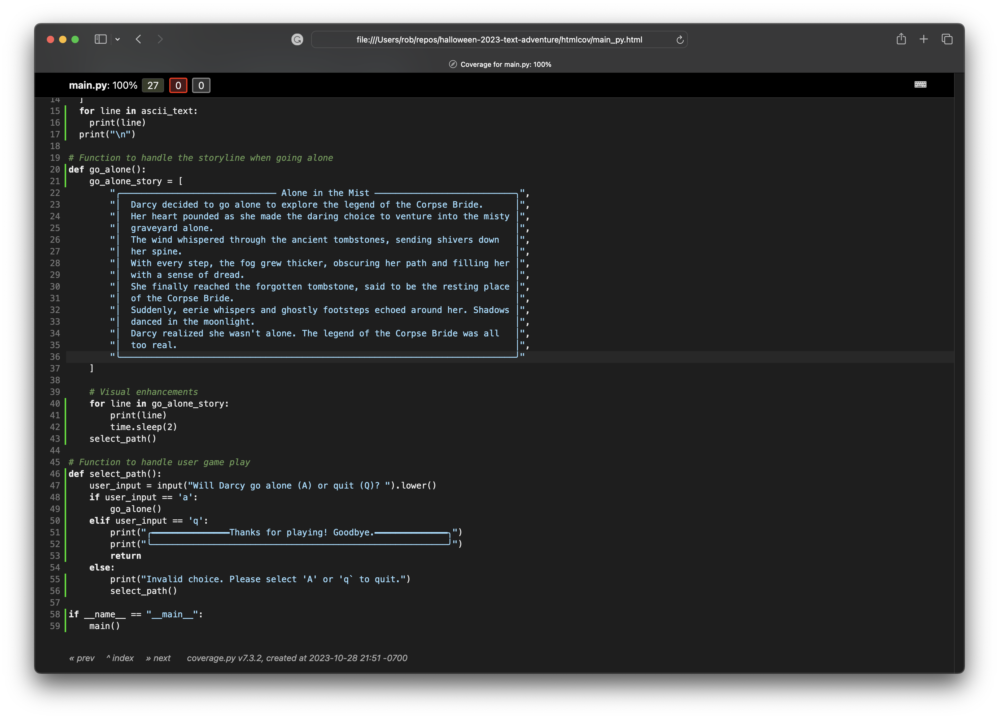
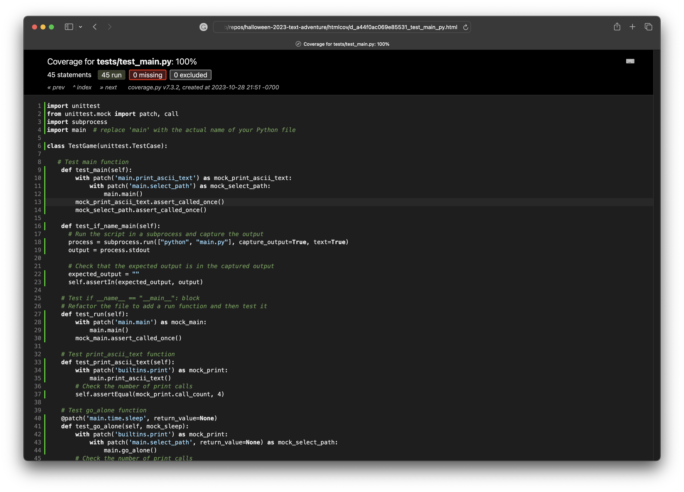
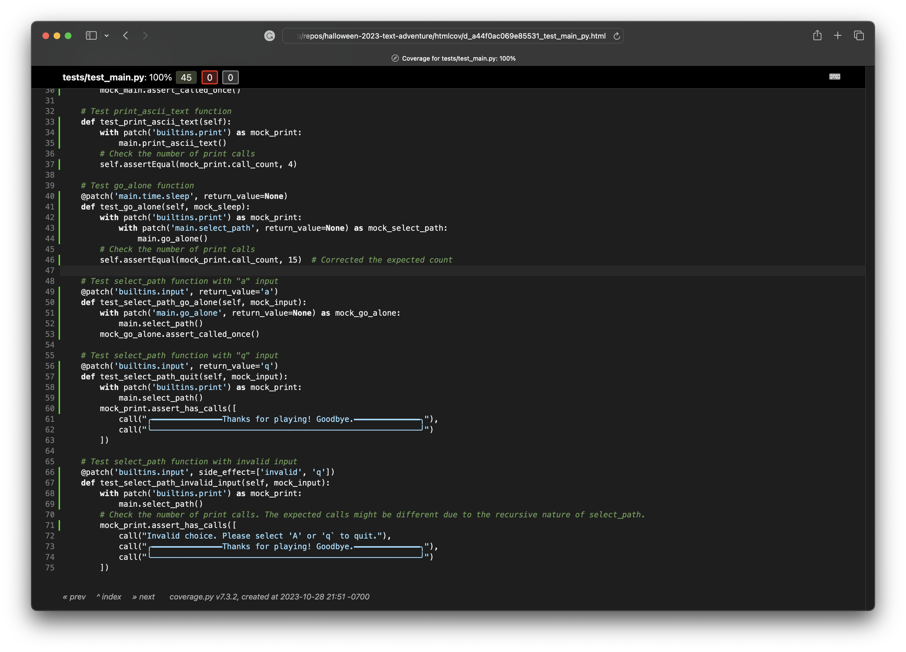

# Welcome

This project used my starter repo at [https://github.com/TheRobBrennan/explore-python](https://github.com/TheRobBrennan/explore-python) as a foundation for following along with [Coding a Halloween Text Adventure Game in Python](https://code.likeagirl.io/coding-a-text-adventure-game-in-python-36f2a0fb1836).











## Local development

If you are using Python for development, the `manage.sh` script provides several utility commands to streamline common tasks:

- `./manage.sh setup` - **Set up the environment and start the application:** This command prepares the development environment by creating a virtual environment in the `.venv` directory (if it doesn't exist). If a `requirements.txt` file is present in the specified app directory (default is `apps/hello_world`), the dependencies listed will be installed. After setting up the environment, the application script (default is `hello_world.py`) is executed.
- `./manage.sh start` - **Start the application:** This command ensures that the virtual environment is set up, activates it, and then runs the specified application script. After execution, the virtual environment is deactivated.
- `./manage.sh test` - **Run tests:** This command ensures that the virtual environment is set up and then runs the tests using pytest. If you want to test with coverage, use the `--coverage` flag.
- `./manage.sh test --coverage` - **Run tests with coverage:** This command runs all tests and generates a coverage report. The report is generated in the `htmlcov` directory, and the index page of the report is automatically opened in your default browser.
- `./manage.sh destroy` - **Clean up the environment:** This command removes the `.venv` virtual environment, effectively deleting all the installed packages and configurations. It's useful when you want to reset your development environment.

Note: You can customize the app directory and script by setting the `APP_DIR` and `APP_SCRIPT` environment variables, respectively. For instance:

```sh
APP_DIR="myappdir" APP_SCRIPT="myscript.py" ./manage.sh
```

This would use `myappdir` as the app directory and `myscript.py` as the application script.

### For JavaScript Developers

If you're more familiar with JavaScript development and have `npm` installed, we've made it easier for you to work with this Python project. There are several helper scripts defined in the `package.json` file which are wrappers around the above `manage.sh` commands:

- `npm run setup` - Sets up the environment and starts the application. Equivalent to `./manage.sh setup`.

- `npm run start` - Starts the application. Equivalent to `./manage.sh start`.

- `npm run test` - Runs all tests. Equivalent to `./manage.sh test`.

- `npm run test:coverage` - Runs tests and generates a coverage report. Equivalent to `./manage.sh test --coverage`.

- `npm run destroy` - Cleans up the environment by removing the virtual environment. Equivalent to `./manage.sh destroy`.

- `npm repo` - Opens the project repository in your default browser. This is a quick way to access the source code, documentation, and other related resources.

Utilizing these npm scripts, you can manage the Python application using commands you're familiar with from the JavaScript ecosystem.
